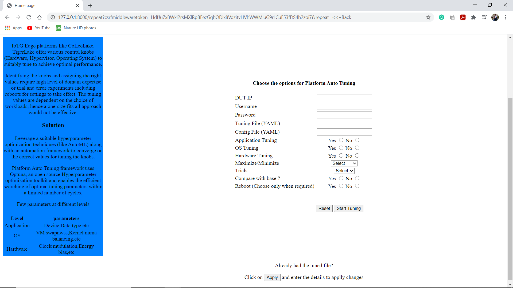
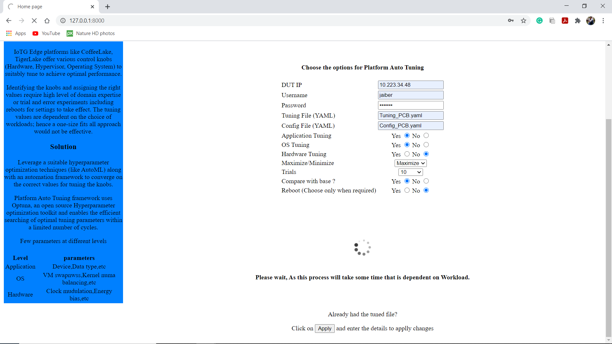
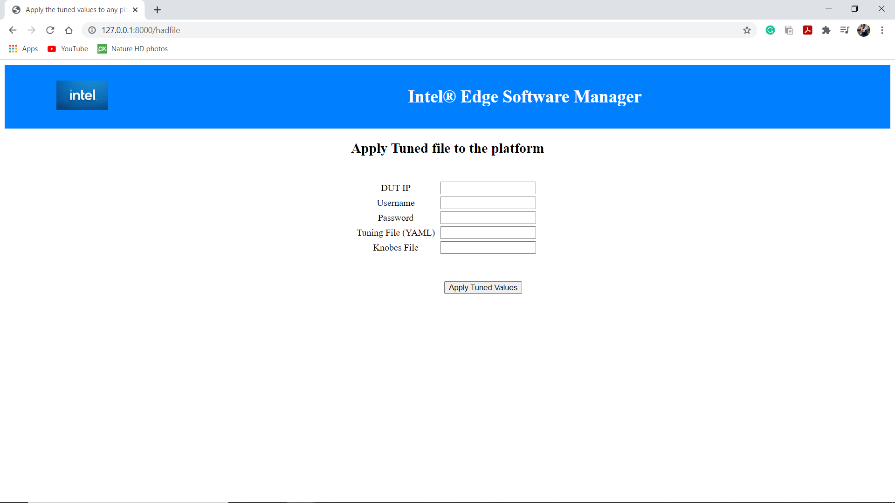
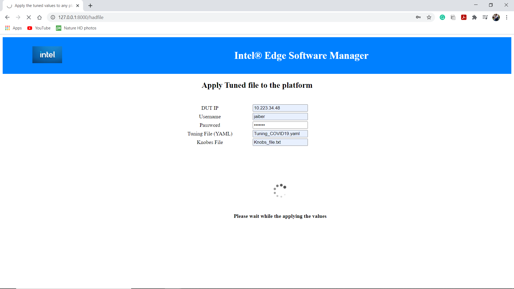
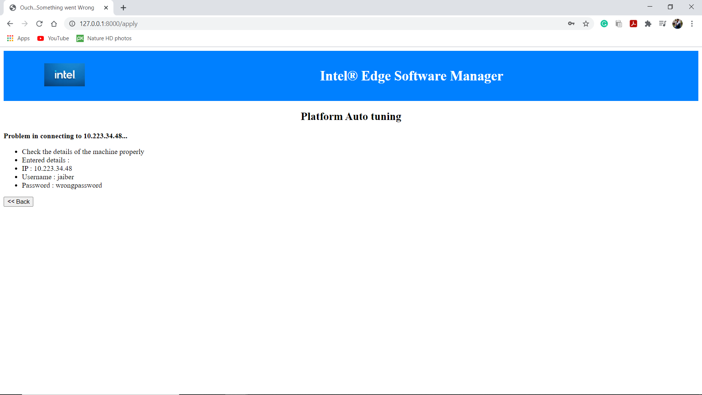
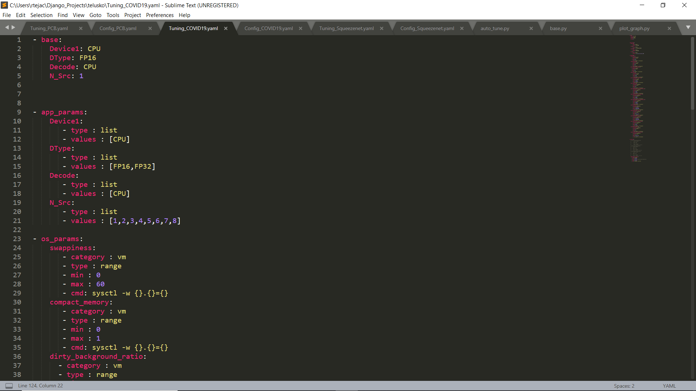
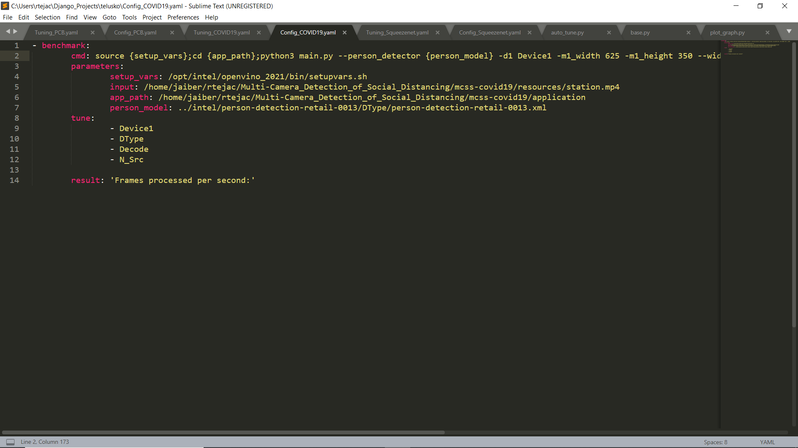
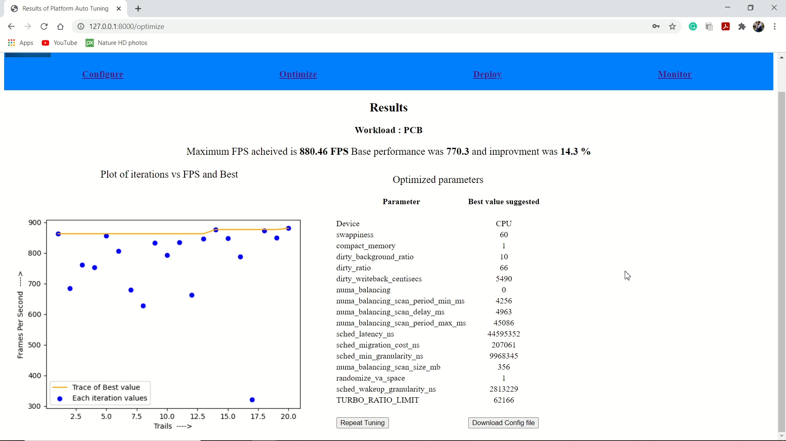
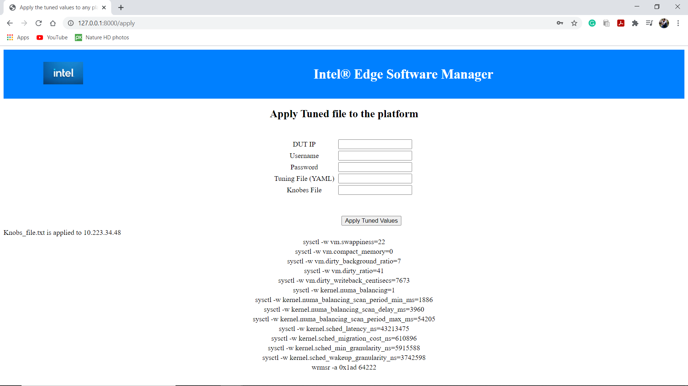

# Auto tuning
This tool is used to auto tune the Hardware and Software parameters for a particular workload.
# Pre requisites

[Python](https://www.python.org/downloads/) version 3.8 and above

[OpenVINO for Linux](https://docs.openvinotoolkit.org/latest/openvino_docs_get_started_get_started_linux.html)

[Optuna](https://pypi.org/project/optuna/)
```
# pip3 install optuna
```
[Paramiko](https://pypi.org/project/paramiko/)

```
# pip3 install paramiko
```

Django
```
# pip3 install django
```
# Installation

Go to $Install_Dir/web_console/web_page/ and run the following command to start the web Application
```
# python3 manage.py runserver

By default it wil take port 8000, If you get a message saying "Port 8000 is already in use", then use different port
# python3 manage.py runserver 8001
```

Then go to 127.0.0.1:8000 (Local_host:port) to get the web UI.


# How to run

### For new platform tuning

Fill the details and Click on 'Optimize', it will show the base performance, Optimized performance and percentage of change.
### Home Page preview


### Home Page preview after starting the process



### Already had the tuned file?

Apply tuned file to any other machine



Loading of Page



#### Note : Files and their locations
```
      Knob files : $Install_Dir/Knob_Files
      Tuning Files : $Install_Dir/Tuning_Files
      Config Files : $Install_Dir/Config_Files
```
### Error Page


For displaying any errors in the process. If all goes well, you can see the respective results page

## Working of this tool

SSH from Paramiko is used to login to remote server and run the workload.

Then by using Optuna, we will create a study object and the we'll call optimize function from Optuna and passes the Objective function and number of trails as arguments to it.

## Files and details about it

#### Tuning file

Tuning.yaml :

Contains the parameters, type of parameters, range of values for each parameter.

  ##### Structure of Tuning file
  ```
-  Level:
    name of parameter:
      - Category (Only for OS level)
      - type of parameter
      - min and max if type is 'range' (or) list of values if type is 'values'
      - command to apply/change that parameter(Only for OS and Hardware)
  ```

  


#### Config file
Config.yaml :

Contains the variables, test commands that are needed to be run to get the Objective(Ex : FPS for an inference application). Information from this file is used to make the commands that are required to run the application which will give the objective(ex: FPS).
##### Structure of Confing file

```
-  Command name:
    cmd : Command to execute in order to get the
    Parameters : Parameters are the variables that will be placed in the command. Variable names are kept inside {} in the cmd
    tune : List of tunables in that command
    result : keyword used to fetch the output(Say FPS for example) after executing the cmd.
```




### Results Page


### Result of applied tuned file page

